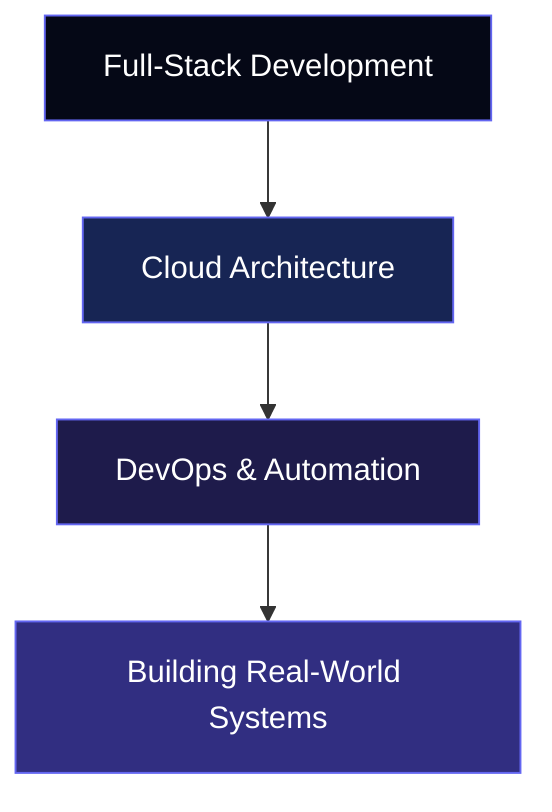

 

## 🪐 About Me

I'm a **Computer Science** engineer who loves building practical software and understanding the infrastructure that powers it. My interests sit at the intersection of **full-stack development, cloud computing, and DevOps** — designing APIs, hardening backend systems, and shipping applications that run reliably in production.

- ☁️ **AWS Certified Solutions Architect – Associate**
- 💻 Building full-stack applications with the **MERN stack**
- 🔐 Exploring authentication, role-based access control, and secure backend systems
- 🚀 Currently diving into **CI/CD** and infrastructure automation
- 🎯 Career focus: **Cloud Engineering · Backend Development · DevOps**

## 🌌 Technology Universe

**Programming Languages**
 

**Full-Stack Development**
 

**Cloud & DevOps**
 

**Tools**
 

<b>☁️ AWS Services & Backend Concepts</b>

 

| Cloud & Infrastructure | Backend & Security         |
|:------------------------|:----------------------------|
| EC2, S3, Lambda         | REST APIs                   |
| VPC, IAM, RDS           | JWT Authentication          |
| CloudFront              | Role-Based Access Control   |
| Nginx, PM2              | bcrypt, Helmet.js           |
| Cloud Computing         | Socket.IO, Nodemailer       |

## 🚀 Featured Projects

<table>
<tr>
<td width="50%" valign="top">

### 🛡️ Visitor Management System
**Enterprise Visitor Registration & Approval Platform**

Role-based visitor registration, multi-stage approval workflows, gate pass generation, and automated email notifications for enterprise front-desk operations.

- Role-based access for Admin, User, Security & HOD
- Multi-stage approval workflows
- Visitor tracking + gate pass generation
- Email notifications & PDF report generation

`Node.js` `Express.js` `MongoDB` `JWT` `Nodemailer` `PDFKit`

</td>
<td width="50%" valign="top">

### 📚 Knowledge Repository
**Document & Training Management Platform**

A full-stack platform for managing training documents, quiz-based assessments, employee certificates, and audit workflows.

- Document management & training assignments
- Quiz-based assessments + certificate generation
- Role-based access for Admin, Employee & Audit
- Department-scoped assignments & approvals

`React` `Vite` `Node.js` `Express.js` `MongoDB` `Mammoth.js`

</td>
</tr>
<tr>
<td width="50%" valign="top">

### 💬 Real-Time Chat Application
**Real-Time Messaging on AWS**

A real-time messaging app with multiple chat rooms, live presence tracking, timestamps, and location sharing — deployed on AWS.

- Real-time messaging via Socket.IO
- Multiple chat rooms + active-user tracking
- AWS EC2 deployment with Nginx reverse proxy
- PM2 process management

`Node.js` `Express.js` `Socket.IO` `MongoDB` `AWS EC2` `Nginx`

</td>
<td width="50%" valign="top">

### 🌦️ More Projects
**Smaller builds, solid fundamentals**

Smaller projects built to sharpen programming and backend fundamentals.

- **Task Manager API** — Node.js, Express.js, MongoDB, JWT
- **Weather Application** — Node.js, Express.js, Handlebars, Open-Meteo API

 

</td>
</tr>
</table>

## 📊 GitHub Stats

 

## 🏆 Certifications & Achievements

| Achievement       | Details                                        |
|:-------------------|:------------------------------------------------|
| ☁️ AWS Certification | AWS Certified Solutions Architect – Associate |
| 🌥️ Google Cloud     | 15+ Google Cloud Skill Badges                 |
| 💠 HackerRank        | 5-Star C++ Programmer                         |
| ⚙️ DevOps            | DevOps Fundamentals — Udemy, 2025             |
| 🖥️ Backend           | Node.js Developer Certification — Udemy, 2025 |

## 🌠 My Journey Ahead

My goal is to keep building, experimenting, and improving — one project at a time.

## 🤝 Let's Connect

I'm always open to connecting with developers and discussing backend systems, cloud architecture, and DevOps.

